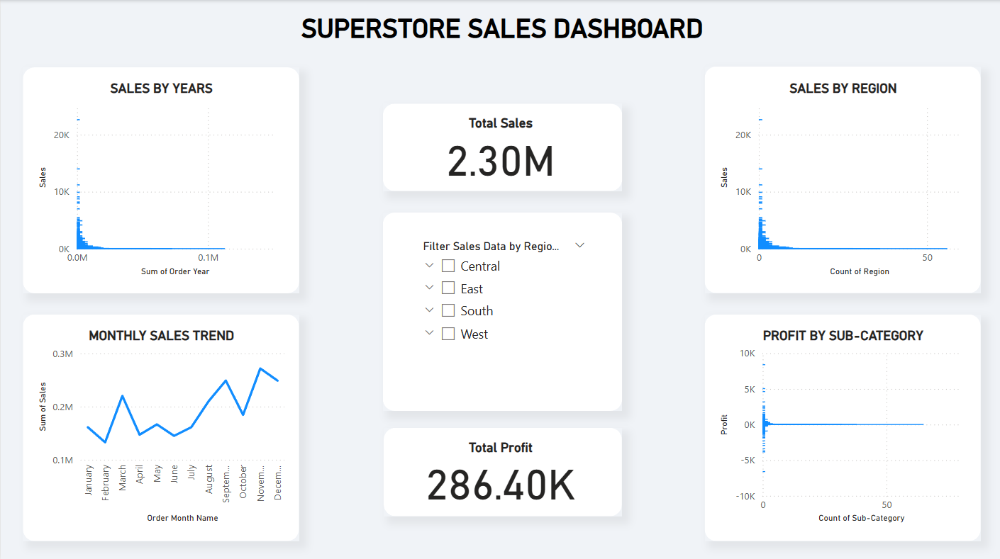
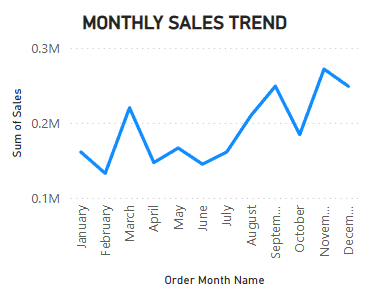
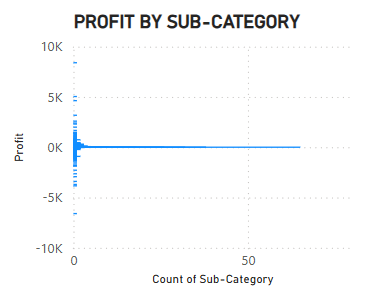

# 🛍️ Sales Data Analysis Dashboard

This project presents a complete analysis of a retail sales dataset using Python (Pandas, Matplotlib, Seaborn) and Power BI. The goal was to extract meaningful business insights, visualize key trends, and build a dynamic dashboard for data-driven decision making.

---

## 📊 Project Objectives

- Clean and prepare sales data for analysis
- Perform exploratory data analysis (EDA) in Python
- Identify top-performing regions, categories, and sub-categories
- Visualize monthly trends and profitability
- Create an interactive Power BI dashboard with filters

---

## 🧰 Tools & Technologies Used

- **Python**: Pandas, Matplotlib, Seaborn, Jupyter Notebook
- **Power BI**: Interactive Dashboard and KPIs
- **Git & GitHub**: Version control and portfolio hosting
- **Dataset**: Superstore Sales Data (Kaggle)

---

## 📈 Key Insights

- The **West** region generated the highest sales, but the **Central** region had better profit margins.
- **Office Supplies** had the most orders, but **Technology** delivered the highest revenue.
- A sharp drop in profits was observed for **Tables** despite high sales — suggesting high discounting or low margins.
- Peak sales occurred during **November and December**, likely due to holiday seasons.

---

## 📊 Power BI Dashboard Preview

> 📌 Below are screenshots from the final dashboard:





---

## 🚀 How to Run This Project

1. Clone this repo:
   ```bash
   git clone https://github.com/arjunnsunil/Sales-Data-Analysis-Dashboard.git
   cd Sales-Data-Analysis-Dashboard

2. Open the notebook under "notebooks/sales_analysis.ipynb" using Jupyter or VS Code.

3. Open "Sales-Dashboard.pbix" using Power BI Desktop to view and explore the interactive dashboard.

---

## 📬 Contact
Arjun C S

LinkedIn: https://www.linkedin.com/in/arjun-c-s-0903b0227/

Email: arjunnnsunil@outlook.com
